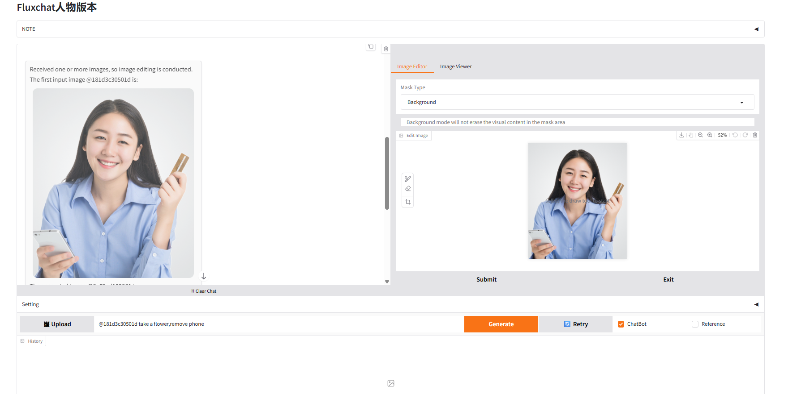

# ChatAce

基于 Flux ACP++ 的图片编辑工具，专注于人物一致性编辑



## 项目简介

ChatAce 是一个基于 Flux ACP++ 架构的智能图像编辑应用程序，主要专注于人物一致性编辑。该项目结合了先进的 AI 图像生成技术和直观的聊天界面，为用户提供强大而易用的图像编辑体验。

## 主要特性

- 🎨 **智能图像编辑**: 基于 Flux ACP++ 的高质量图像生成和编辑
- 👤 **人物一致性编辑**: 专业的人物形象保持和修改功能  
- 💬 **聊天式交互**: 直观的对话界面，通过文本指令进行图像编辑
- 🖼️ **多种编辑模式**: 支持背景编辑、合成编辑和外扩绘制
- 📊 **历史管理**: 完整的编辑历史记录和图像管理功能
- ⚡ **实时预览**: 即时查看编辑效果

## 环境要求

- Python 3.8+
- PyTorch
- CUDA (推荐用于 GPU 加速)
- 所需 Python 包请参见项目依赖

## 安装指南

### 1. 克隆项目
```bash
git clone https://github.com/leeguandong/ChatAce.git
cd ChatAce
```

### 2. 解压ComfyUI
```bash
unzip ComfyUI.zip
```

## 启动方式

### 快速启动
```bash
cd fluxchat
python app_fluxchat.py
```

### 自定义配置启动
```bash
# 修改 app_fluxchat.py 中的配置参数
python app_fluxchat.py --port 9005 --host 0.0.0.0
```

启动成功后，在浏览器中访问：
```
http://localhost:9005
```

## 使用说明

### 基本操作流程

1. **上传图像**: 点击 "🖼️ Upload" 按钮上传要编辑的图片
2. **输入指令**: 在指令框中输入编辑要求，例如：
   - "将这个人的头发变成金色"
   - "更换背景为海边场景"
   - "添加一副眼镜"
3. **参数调整**: 在设置面板中调整生成参数：
   - **Sample Step**: 采样步数 (1-1000)
   - **Guidance Scale**: 引导强度 (1.0-100.0)
   - **Seed**: 随机种子 (-1 为随机)
   - **Height/Width**: 输出图像尺寸
4. **生成结果**: 点击 "Generate" 开始处理

### 高级功能

#### 历史管理
- 使用 `@` 符号引用历史图像，如 `@abc123 修改发色`
- 开启 "Use History" 选项保持编辑链条的连续性

#### 编辑模式
- **Background**: 背景编辑模式，不会擦除蒙版区域内容
- **Composite**: 合成模式，会擦除蒙版区域内容
- **Outpainting**: 外扩绘制模式，用于扩展图像边界

#### 界面模式
- **ChatBot 模式**: 对话式编辑界面 (推荐)
- **Legacy 模式**: 传统的图像编辑界面

## 项目结构

```
ChatAce/
├── fluxchat/              # 主要应用代码
│   ├── app_fluxchat.py    # 主应用程序
│   ├── acepp.py           # Flux ACP++ 核心功能
│   └── chat_utils.py      # 聊天工具函数
├── ComfyUI/               # ComfyUI 集成
├── results/               # 生成结果存储目录
├── webui.png             # 界面截图
└── README.md             # 项目说明文档
```

## 配置说明

### 模型配置
在 `app_fluxchat.py` 中可以配置：
- 模型选择: `model_choices`
- 缓存目录: `cache_dir`
- 最大消息数: `max_msgs`

### 服务器配置
```python
# 在 app_fluxchat.py 末尾修改
demo.launch(
    server_name="0.0.0.0",  # 监听地址
    server_port=9005,       # 端口号
    allowed_paths=["/path/to/results"]  # 允许访问的路径
)
```

## 界面预览

应用程序提供了直观的 Web 界面，包含以下主要区域：

- **聊天区域**: 显示编辑历史和对话记录
- **控制面板**: 参数设置和功能选择
- **图像编辑器**: 支持蒙版编辑和区域选择
- **历史画廊**: 快速访问之前的编辑结果

## 故障排除

### 常见问题

1. **启动失败**
   - 检查 Python 版本是否 >= 3.8
   - 确认所有依赖包已正确安装
   - 检查 CUDA 环境配置

2. **生成速度慢**
   - 确保使用 GPU 加速
   - 适当调整 Sample Step 参数
   - 检查系统内存使用情况

3. **图像质量问题**
   - 调整 Guidance Scale 参数
   - 尝试不同的随机种子值
   - 确保输入图像质量良好

### 日志查看
应用程序会输出详细的运行日志，可以通过控制台查看处理进度和错误信息。

## 许可证

本项目采用开源许可证，具体条款请查看 LICENSE 文件。

## 贡献

欢迎提交 Issue 和 Pull Request 来帮助改进项目！

## 联系方式

- 项目地址: [https://github.com/leeguandong/ChatAce](https://github.com/leeguandong/ChatAce)
- 问题反馈: [Issues](https://github.com/leeguandong/ChatAce/issues)

---

**注意**: 本项目需要一定的计算资源，推荐在具有 GPU 的环境中运行以获得最佳性能。
